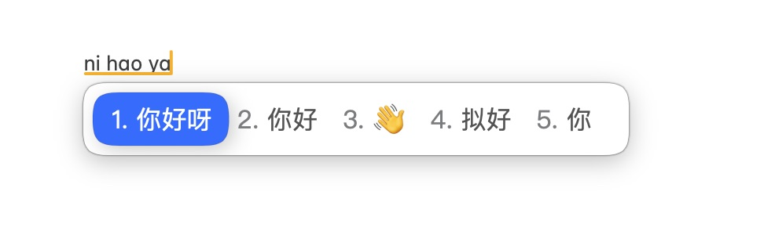

# 蓝色遐想

一款简洁好看的蓝色遐想配色 RIME 输入法主题，支持亮色与暗色模式。

## 如何安装

1. 下载 `squirrel.custom.yaml` 文件。
2. 将文件放到 Rime 配置文件夹。
3. 在 Rime 输入法中点击「重新部署」按钮即可生效。

## 思路

尽可能使用了 macOS 自带的颜色。亮色模式采用白底，暗色模式尽可能使用了磨砂（液态玻璃）效果，但效果有限。

你也可以使用鼠须管主要维护者开发的[主题配置App](https://github.com/LEOYoon-Tsaw/Squirrel-Designer)自己创建喜欢的主题！

## 感谢

 - [Rime](https://github.com/rime)
 - [squirrel（鼠须管）](https://github.com/rime/squirrel)
 - [雾凇拼音词库](https://github.com/iDvel/rime-ice)
